<p align="center">
  <picture>
    <source media="(prefers-color-scheme: dark)" srcset="projects/switchboard/docs/brand/readme/hero-dark.svg">
    
  </picture>
</p>

<p align="center">
  <b>bise</b> /beez/ · french, n.<br>
  1. a quick kiss on the cheek :*<br>
  2. a brisk north wind<br>
  3. a terminal where your agents ship while you think
</p>

<p align="center">
  <a href="https://bise.dev">bise.dev</a> ·
  <a href="https://bise.dev/book/">the brand book</a> ·
  <a href="#install">install</a>
</p>

<br>

<p align="center">
  <picture>
    <source media="(prefers-color-scheme: dark)" srcset="projects/switchboard/docs/brand/readme/demo-dark.svg">
    
  </picture>
</p>

## you didn't become an engineer to babysit robots.

today you started five things. you watched output scroll. you answered "should i continue?" eleven times.

two agents edited the same file, and you found out from the red tests. you pasted the same context into three tabs. you had a great idea at 2pm, and you let it go, because one more tab was one too many.

at 6pm you'd shipped more than ever, and you felt like you did nothing.

that feeling has a name: context switching. forty times a day. it makes the best job in the world feel miserable.

**bise does the switching for you. you stay in flow.**

## one thread. a whole team.

bise is a terminal app. you talk to **main**, bise's main agent. main splits your ideas into jobs and runs the other agents for you.

<p align="center">
  <picture>
    <source media="(prefers-color-scheme: dark)" srcset="projects/switchboard/docs/brand/readme/team-dark.svg">
    
  </picture>
</p>

| | |
|---|---|
| **one thread per repo** | one thread to talk to. peek into any agent when you feel like it. main knows everything going on in the repo, even what you did last month. |
| **main is always listening** | the team is busy. main never is. ask, add a thing, change your mind while the agents work. |
| **a team that runs itself** | they talk behind your back. in a good way. agents tell each other what they touch, make a worktree only when they need their own copy, and clean it up after. |
| **forget there are agents** | no yaml was harmed. no roles, no graph, no config. you just dump your ideas in the thread. |

## kiss your backlog goodbye.

- **talk whenever. you never wait** · say the next thing while the last one runs. the composer is never locked.
- **agents sync on their own** · every agent can message every other one. it's folded out of your way.
- **all your MCPs. all your skills. always on** · connect as many MCP servers as you want. bise calls tools through code, so a hundred servers don't fill its context.
- **only the real decisions reach you** · one card, a couple of choices, one key.
- **you're not the router** · main answers the obvious questions itself, the way you would, and tells you why.
- **talk to any agent, anytime** · `⌥` + a number, or `@name`.
- **change your mind mid-run** · a correction lands in the running agent. ✓ it got it, ✓✓ it read it.
- **nothing gets dropped** · when an agent stops half-way, main picks the work back up.
- **worktrees, only when they help** · made when needed, cleaned up after.
- **bring your Agent Plugins** · skills, MCP servers and hooks in the [Agent Plugins](https://agent-plugins.org) format load as they are, from `~/.agents/plugins` or your repo.

<details>
<summary><b>and so much more</b></summary>

- **your token bill can relax** · bise starts an agent when a job needs one. that's the whole rule.
- **it's quiet. open it up whenever** · the rest is folded, never deleted. `ctrl+o` opens it all, every script in full.
- **or just talk** · `/voice`, then `ctrl+r`.
- **show it a screenshot** · paste it with `ctrl+v` or drag it in.
- **ask about anything on screen** · select lines in the history and start typing: they come along as a quote.
- **a model per agent** · `/model` and `/reasoning`.
- **a real shell, one key away** · `ctrl+\`` opens a terminal in your repo.
- **hold ctrl to see the shortcuts** (Ghostty, kitty).
- **tables that fit** · your terminal, light or dark, text at a reading width.

</details>

## install

> [!NOTE]
> bise is pre-release. macOS (Apple Silicon) first.
> the one-line installer below goes live with the first release. until then, build from source.

```sh
curl -fsSL bise.dev/install | sh    # soon
```

from source:

```sh
git clone https://github.com/gvergnaud/bise && cd bise
./run.sh                            # builds and starts bise in the current folder
```

then, in any repo:

```sh
cd ~/your-repo
bise            # the first run walks you through a theme, a model key and the folder
bise doctor     # checks your install, keys and running hubs
```

## what's in here

| | |
|---|---|
| [`rust/`](rust/) | the app: the terminal UI, the agent harness, plugins, sessions |
| [`hub/`](hub/) | the Switchboard hub, written in [Bend](https://github.com/HigherOrderCO/Bend) |
| [`projects/switchboard/`](projects/switchboard/) | design docs, packaging, tests |
| [`projects/switchboard/docs/brand/`](projects/switchboard/docs/brand/) | the brand book, the site, these images |

## made by a human. shipped with bise

hi, i'm [Gabriel](https://github.com/gvergnaud). i build coding agents for a living. i'm one of the people behind Mistral's agent tools, like Vibe.

agents made me faster. they also made my days feel empty. so i built the tool i wanted: one thread, a team behind it, and me in flow. most of bise was built with bise.

i want everyone to ship like a team of a hundred, and to love building again. bise is open source and indie. i read every issue.

## license

Apache-2.0, see [LICENSE](LICENSE). third-party components: [THIRD_PARTY_NOTICES](THIRD_PARTY_NOTICES).

<p align="center"><br><b>ideas in. little kisses out. also pull requests.</b> :*</p>
