<p align="center">
  <picture>
    <source media="(prefers-color-scheme: dark)" srcset="docs/brand/readme/hero-dark.svg">
    
  </picture>
</p>

<p align="center">
  <b>bise</b> /beez/ · french, n.<br>
  1. a quick kiss on the cheek :*<br>
  2. a brisk north wind<br>
  3. a terminal where multi-agent coding is painless
</p>

<p align="center">
  <a href="https://bise.dev">bise.dev</a> ·
  <a href="#install">install</a> ·
  <a href="#features">features</a> ·
  <a href="https://bise.dev/book/">brand book</a>
</p>

<br>

**meet your team lead. you stay in flow, it runs the agents.**

bise is a terminal app for multi-agent coding. there's one thread per repo, and in it you talk to **main**, your team lead. main splits your ideas into jobs, starts an agent when a job needs one, keeps them in sync, and only comes back to you when a decision is yours.

you stop micromanaging agents. no sessions to juggle, no workflow to design, nothing to configure. the multi-agent part is built in, and it has opinions.

<p align="center">
  <picture>
    <source media="(prefers-color-scheme: dark)" srcset="docs/brand/readme/demo-b-dark.svg">
    
  </picture>
</p>

## install

```sh
curl -fsSL bise.dev/install | sh
```

then start it in the repo you want to work on:

```sh
cd ~/your-repo
bise
```

the first run walks you through a theme and a model key. `bise doctor` checks your install, your keys and the running hubs.

switching from Claude Code or Codex? paste this into it:

```text
read https://bise.dev/setup.md and set bise up for me
```

your agent installs bise and brings over what you already have: your API key, your model, your `CLAUDE.md`, skills and MCP servers. it shows you one plan and waits for your yes. it never prints a key. if your agent can't open links, paste [the full prompt](https://bise.dev/setup) instead. a Claude Pro/Max or ChatGPT subscription isn't an API key: bise needs a key.

> [!NOTE]
> bise is pre-release. **macOS only for now** (Apple silicon and Intel). linux is next.
> bring your own key: Anthropic, OpenAI, Mistral and more.

## how it works

- **one thread per repo.** you always talk to the same thread. it never ends: when it gets long, bise compacts it and keeps going.
- **main is the team lead.** it answers what it can, starts an agent when a job needs one, follows up, and picks up work that stopped half-way.
- **agents work in the background,** in your checkout. they message each other before they touch the same files. one makes a git worktree only when it needs its own copy, and cleans it up after.
- **the inbox holds the decisions that need you.** only the real ones reach you. they wait above your message (`ctrl+1`, or a click), never in the middle of your sentence.

four words to learn: you, main, agents, inbox.

## the models grew up. you can stop babysitting

ten things you'll notice in the first hour.

### the team runs itself

#### hand it something huge

give main a big goal. it splits it into jobs, runs the agents, restarts the ones that stop half-way, and keeps going until it's done.

<picture><source media="(prefers-color-scheme: dark)" srcset="docs/brand/readme/feat/resume-dark.svg"></picture>

#### worktrees? don't think about it

agents share your folder. when one needs its own copy, it makes a worktree, works there and cleans it up after. no branch to name, no folder to delete, nothing to keep in your head.

<picture><source media="(prefers-color-scheme: dark)" srcset="docs/brand/readme/feat/worktree-dark.svg"></picture>

### your head stays yours

#### talk whenever. you never wait

say the next thing while the last one runs. your composer is never locked.

<picture><source media="(prefers-color-scheme: dark)" srcset="docs/brand/readme/feat/talk-dark.svg"></picture>

#### zen mode while you type

start typing and everything else fades: the agents, the counts, the chatter. just you and your words. send it and it all comes back. what the agents said to each other stays folded, ctrl+o opens it.

<picture><source media="(prefers-color-scheme: dark)" srcset="docs/brand/readme/feat/zen-dark.svg"></picture>

### no more "yes, continue"

#### you're not the router

main answers the agents for you: the obvious questions, the way you would, and it tells you why. only the real decisions reach you.

<picture><source media="(prefers-color-scheme: dark)" srcset="docs/brand/readme/feat/card-dark.svg"></picture>

#### agents sync on their own

every agent can talk to every other one. they ask, share and hand off quietly, folded out of your way.

<picture><source media="(prefers-color-scheme: dark)" srcset="docs/brand/readme/feat/sync-dark.svg"></picture>

### every tool you have

#### all your MCPs. all your skills. always on

GitHub, Linear, Sentry, Slack, your docs, your database: connect as many MCP servers as you want, and never pick which ones to turn on. bise calls tools through code, so a hundred servers don't fill its context.

<picture><source media="(prefers-color-scheme: dark)" srcset="docs/brand/readme/feat/tools-dark.svg"></picture>

#### bring your Agent Plugins

skills, MCP servers, hooks: plugins in the Agent Plugins format load as they are, from ~/.agents/plugins or your repo. Vibe plugins too.

<picture><source media="(prefers-color-scheme: dark)" srcset="docs/brand/readme/feat/plugins-dark.svg"></picture>

### you're still the boss

#### talk to any agent, anytime

⌥ + a number, or @name. ask it why, push it, then go back to main. nobody has to stop.

<picture><source media="(prefers-color-scheme: dark)" srcset="docs/brand/readme/feat/direct-dark.svg"></picture>

#### fits your PR flow

in a repo that takes pull requests, every change gets its own branch and its own PR, then goes through your usual flow: CI, review bots, teammates. the panel shows where each one stands.

<picture><source media="(prefers-color-scheme: dark)" srcset="docs/brand/readme/feat/prs-dark.svg"></picture>

## polished down to the last character

hundreds of tiny details. you'll feel them before you see them.

#### your token bill can relax

bise starts an agent when a job needs one. that's the whole rule. there's no committee of agents reviewing each other in circles.

<picture><source media="(prefers-color-scheme: dark)" srcset="docs/brand/readme/feat/tokens-dark.svg"></picture>

#### show it a screenshot

paste it with ctrl+v or drag it in. an image is one chip in your text.

<picture><source media="(prefers-color-scheme: dark)" srcset="docs/brand/readme/feat/screenshot-dark.svg"></picture>

#### or just talk

turn on /voice, press ctrl+r, say it.

<picture><source media="(prefers-color-scheme: dark)" srcset="docs/brand/readme/feat/voice-dark.svg"></picture>

#### ask about anything on screen

select a few lines in the history and start typing: they come along as a quote.

<picture><source media="(prefers-color-scheme: dark)" srcset="docs/brand/readme/feat/quote-dark.svg"></picture>

#### a model per agent

the big one for the hard job, a fast one for the chores. /model and /reasoning.

<picture><source media="(prefers-color-scheme: dark)" srcset="docs/brand/readme/feat/model-dark.svg"></picture>

#### a real shell, one key away

ctrl+` opens a terminal in your repo. it keeps running while hidden.

<picture><source media="(prefers-color-scheme: dark)" srcset="docs/brand/readme/feat/shell-dark.svg"></picture>

#### restart whenever you like

update to the latest version mid-work, or quit and come back tomorrow. no work is ever lost: your agents resume right away, and your thread, your draft and your queue come back too.

<picture><source media="(prefers-color-scheme: dark)" srcset="docs/brand/readme/feat/restart-dark.svg"></picture>

#### agent communication is proven correct

we have the proof, thanks to [Bend](https://bend-lang.com), a language built for the LLM era. no message lost, none sent twice.

<picture><source media="(prefers-color-scheme: dark)" srcset="docs/brand/readme/feat/proof-dark.svg"></picture>

#### your terminal

your colors, light or dark, text at a reading width.

<picture><source media="(prefers-color-scheme: dark)" srcset="docs/brand/readme/feat/theme-dark.svg"></picture>

## from source

```sh
git clone https://github.com/gvergnaud/bise && cd bise
./run.sh    # builds and starts bise in the current folder
```

## what's in here

- [`rust/`](rust/) · the app: the terminal UI, the agent harness, plugins, sessions
- [`bend/`](bend/) · the agent runtime and the Switchboard hub, written in [Bend](https://github.com/HigherOrderCO/Bend), and their laws (`LAWS.bend`, `PROOF.bend`)
- [`prompts/`](prompts/) · the system prompts and tool descriptions the agents read
- [`scripts/`](scripts/) · dev scripts: build the Bend binaries, build and switch versions
- [`docs/`](docs/) · design docs, RFCs, the implementation notes
- [`site/`](site/) · [bise.dev](https://bise.dev), a static site (the installer too)
- [`tests/`](tests/) · the gate (`gate.sh`), e2e and TUI tests
- [`packaging/`](packaging/) · build, install and release scripts
- [`docs/brand/`](docs/brand/) · the brand book, the issue list, these images

## license

Apache-2.0, see [LICENSE](LICENSE). third-party components: [THIRD_PARTY_NOTICES](THIRD_PARTY_NOTICES).

<p align="center"><br>ideas in. little kisses out. also pull requests. :*</p>
